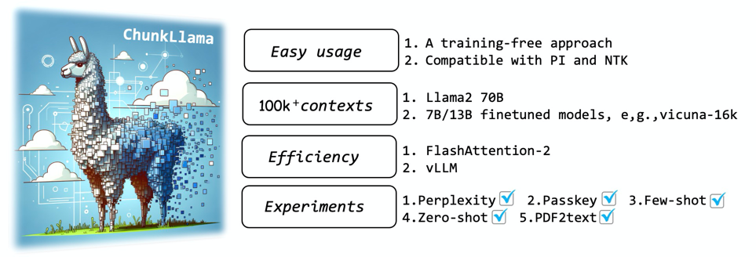

<p align="center" width="100%">

</p>

# Training-Free Long-Context Scaling of Large Language Models

[](https://huggingface.co/L4NLP)
[](https://huggingface.co/datasets/L4NLP/chunkllama-long-dialog)
[](https://arxiv.org/abs/2402.17463)


###  Overview
Dual chunk attention is a training-free and effective method for extending the context window of large language models (LLMs) to more than 8x times their original pre-training length. We refer to the Llama-based model with dual chunk attention as ChunkLlama. DCA can be seamlessly integrated with (1) popular extrapolation methods such as [Positional Interpolation (PI)](https://arxiv.org/abs/2306.15595) and [NTK-Aware RoPE](https://github.com/huggingface/text-generation-inference/issues/512); and (2) widely-used libraries for memory-efficient inference like [FlashAttention](https://github.com/Dao-AILab/flash-attention) and [vLLM](https://github.com/vllm-project/vllm).

Due to the high cost of continual pretraining on longer sequences, previously released long-context models are typically limited to scales of 7B/13B. We demonstrate that by applying DCA to [Llama2 70B](https://huggingface.co/meta-llama/Llama-2-70b-chat-hf), the model exhibits surprising extrapolation capabilities (100k context length) and a very strong understanding of practical long-context tasks.

### Updates 
* 🚨🚨🚨 07/03/24 Please **update the code** for function `merge_attn_outputs()`. We find a bug 🐞 when merging attention weights from different chunks. Sorry for the inconvenience. 
* 08/03/24 Two key feautures of vLLM including Flash decoding (speed up the decoing) and Paged attention (better kv-cache management) are comming soon.
  
### 🚀Quick Start
As a training-free method, only one line needs to be added to your original inference code for the Llama2 model:
```bash
replace_with_chunkllama(pretraining_length=4096)
```
#### Full inference code
```bash
from transformers import AutoTokenizer, AutoModelForCausalLM
from chunkllama_attn_replace import replace_with_chunkllama
##### add this line #####
replace_with_chunkllama(pretraining_length=4096)

tokenizer = AutoTokenizer.from_pretrained("meta-llama/Llama-2-7b-hf", trust_remote_code=True)
model = AutoModelForCausalLM.from_pretrained("meta-llama/Llama-2-7b-hf", trust_remote_code=True, torch_dtype=torch.bfloat16)
inputs = tokenizer("Long...docs\n Q: How to extend the context window of LLMs? ", return_tensors="pt")
output_ids = model.generate(**inputs, max_length=128)[0]
print(tokenizer.decode(output_ids))
```
#### Chat with a lengthy PDF file
We have provided a collection of influential papers on long-context scaling of LLMs in the `Popular_PDFs` directory. By using the `--pdf` parameter, you can access the latest advancements in this field through ChunkLlama⭐.
<p align = "center">

</p>
All of these papers are released recently and are impossible to be used during pretraining. 


### Usage Requirements
1. Prepare the environment. 
```bash
pip install -r requirements.txt
pip install flash-attn --no-build-isolation (FlashAttention >= 2.0.1)
```
2. Download the pretraining weights (Extended ctx means the context length enabled by DCA).

| Supported Models                                                                  | Extended ctx |
|:------------------------------------------------------------------------------------|:------------:|
| Base Models                                                                         |              |
| [Llama-2-7b-hf (4k)](https://huggingface.co/meta-llama/Llama-2-7b-hf)               |     32k      | 
| [Llama-2-13b-hf (4k )](https://huggingface.co/meta-llama/Llama-2-13b-hf)            |     32k      |
| [Llama-2-70b-hf (4k)](https://huggingface.co/meta-llama/Llama-2-70b-hf)             |     128k     | 
| [Together's LLaMA-2-7b-32k](https://huggingface.co/togethercomputer/LLaMA-2-7B-32K) |     200k     | 
| SFT Models                                                                          |              |
| [Llama-2-7b-chat-hf (4k)](https://huggingface.co/meta-llama/Llama-2-7b-chat-hf)     |     32k      |
| [Llama-2-13b-chat-hf (4k)](https://huggingface.co/meta-llama/Llama-2-13b-chat-hf)   |     32k      |
| [Llama-2-70b-chat-hf (4k)](https://huggingface.co/meta-llama/Llama-2-70b-chat-hf)   |     128k     |
| [Vicuna-1.5-7b-16k](https://huggingface.co/lmsys/vicuna-7b-v1.5-16k)                |     200k     |
| [Vicuna-1.5-13b-16k](https://huggingface.co/lmsys/vicuna-13b-v1.5-16k)              |     200k     |
| [Mixtral 8x7b](https://huggingface.co/mistralai/Mixtral-8x7B-Instruct-v0.1)        |     todo     |
| [Qwen1.5](https://huggingface.co/Qwen/Qwen1.5-14B-Chat) 中文                        |     todo     |
| [ChunkLlama-sft-7b-16k (ours)](https://huggingface.co/L4NLP/todo)                   |     200k     |
| [ChunkLlama-sft-13b-16k (ours)](https://huggingface.co/L4NLP/todo)                  |     200k     |

3. Deploy your own demo.
We provide three examples of how to employ DCA on popular LLMs in `run_chunkllama_100k.py`, `run_together_200k.py` and `run_vicuna_200k.py`.

Run the demo:
```python
python run_chunkllama_100k.py --pdf Popular_PDFs/longlora.pdf --scale 13b (7b/13b/70b)
```

📌 Notice: We have found that although 7B models can achieve low perplexity on long contexts, they often make mistakes in practical tasks, including those with fine-tuned versions. Therefore, we recommend using the larger 13B (ChunkLlama-13b, Chunk-Vicuna-13b) or 70B (ChunkLlama-70B) models for higher accuracy.
### Fine-tuning
ChunkLlama can be further improved by fine-tuning on long conversations. We further train ChunkLlama on with a context window of 16k on concatenated dialogues from the previous SFT datasets ShareGPT and AlpacaGPT4. 
The data we use is available [here](https://huggingface.co/datasets/L4NLP/chunkllama-long-dialog)

```bash
cd fine-tune
export CUDA_VISIBLE_DEVICES=0,1,2,3,4,5,6,7
export WANDB_MODE=dryrun

python -m torch.distributed.run --nproc_per_node=8 \
         train_chunkllama_16k.py \
        --model_name_or_path meta-llama/llama-2-7b-chat-hf \
        --bf16 \
        --output_dir checkpoints/chunkllama-7b-release \
        --max_steps 1600    \
        --per_device_train_batch_size 1 \
        --per_device_eval_batch_size 1  \
        --gradient_accumulation_steps 2 \
        --evaluation_strategy no \
        --save_strategy steps \
        --save_steps 400  \
        --save_total_limit 2 \
        --learning_rate 2e-5 \
        --weight_decay 0.  \
        --warmup_ratio 0.03  \
        --lr_scheduler_type "cosine" \
        --logging_steps 1  \
        --fsdp "full_shard auto_wrap" \
        --fsdp_transformer_layer_cls_to_wrap 'LlamaDecoderLayer' \
        --tf32 True  \
        --model_max_length 16384  \
        --gradient_checkpointing True  \
        --lazy_preprocess True \
        --pretraining_length 4096
```
You can change `--model_name_or_path`, `--output_dir` to your own directory. In our experiments, we directly train the chat version of Llama2, you can also use its base version.


### Experiments 
This section contains the data and code for validating ChunkLlama on different types of long-context tasks.
#### Perplexity validation on PG19

```bash
cd ppl
python test_ppl.py --seq_len 16384 --scale 13b (7b/13b/70b)
```
where `--seq_len 16384` denotes the length of input prompts. We use tokenized the tokenized validation  split of PG19 provided by [longlora](https://github.com/dvlab-research/LongLoRA). The data is stored in `ppl/data/pg19.validation.bin`.

#### Passkey Retrieval
We provide a manner to test the passkey retrieval accuracy. For example,
```bash
cd passkey
python test_passkey.py --seq_len 16384 --scale 13b (7b/13b/70b)
```


#### Few-shot Learning
The experimental settings of few-shot learning are the same as that in Llama2 Long. We use 4 popular long-context benchmarks: [NarrativeQA](https://github.com/google-deepmind/narrativeqa), [QMSum](https://github.com/Yale-LILY/QMSum), [Qasper](https://github.com/allenai/qasper-led-baseline), and [Quality](https://github.com/nyu-mll/quality).
We also release the data together with in-context examples in [few-shot-data](https://drive.google.com/file/d/1Cs6MkSFsE2SQi9SUOE5mmyLyxPWef3bL/view?usp=sharing). We report the results on their validation sets. The in-context examples are randomly selected from the training set.
```bash
cd few-shot
python test_few_shot.py --data_path data/few_shot_quality.jsonl --max_length 16k --scale 13b 
```
where `--data_path` denotes the path to the dataset assuming the data is saved in `few-shot/data/`.
The generation results will be saved to `Predictions/Chunkllama-13b16k/few_shot_quality.json`

We use the validation scripts provided by [Scrolls](https://github.com/tau-nlp/scrolls) to obtain the results:
```bash
python auto_eval.py   --dataset_name quality  --metrics_output_dir ./  --predictions Predictions/Chunkllama-13b16k/few_shot_quality.json  --test_data_file data/few_shot_quality.jsonl
```

#### Zero-shot Learning
We also test our method on the chat version of Llama2 on zero-shot learning tasks.
Considering the challenges of fair evaluation on open-ended tasks. We select 4 closed-ended tasks from [L-Eval](https://github.com/OpenLMLab/LEval/) with diverse input lengths ranging from 3k to 27 tokens.
```bash
cd zero-shot
python test_zero_shot.py --task_path Closed-ended-tasks/coursera.jsonl --max_length 16k --scale 13b
```
The experimental settings and evaluation scripts are the same as those in the official repository of L-Eval.
```bash
python Evaluation/auto_eval.py --pred_file Predictions/Chunkllama-13b16k/coursera.jsonl 
```

### Acknowledgements
We sincerely appreciate the assistance provided by the following people (works) for ChunkLlama:
- We gain useful background and insights from [Jianlin Su](https://github.com/bojone)'s [blogs](https://kexue.fm/). We recommend interested researchers to read his blogs to get a better understanding of the long-context scaling of LLMs.
- This work is built upon the [LLaMA2](https://ai.meta.com/llama) as the pre-trained models. We also use [Vicuna](https://github.com/lm-sys/FastChat), [Together's Llama2 fork](https://huggingface.co/togethercomputer/LLaMA-2-7B-32K), and [CodeLlama](https://huggingface.co/codellama/).
- We use the code from [LongChat](https://github.com/DachengLi1/LongChat) for the finetuning process and code from [longlora](https://github.com/dvlab-research/LongLoRA) for validating our method.
- We thank [Yukang Chen](https://github.com/yukang2017) for his help and valuable discussions.
- We thank [Hang Yan](https://scholar.google.com/citations?user=yigHzW8AAAAJ&hl=en) for his valuable comments on this work.

### Citation
```
@misc{an2024trainingfree,
      title={Training-Free Long-Context Scaling of Large Language Models}, 
      author={Chenxin An and Fei Huang and Jun Zhang and Shansan Gong and Xipeng Qiu and Chang Zhou and Lingpeng Kong},
      year={2024},
      eprint={2402.17463},
      archivePrefix={arXiv},
      primaryClass={cs.CL}
}
```

## License
- ChunkLlama is licensed under the Apache License 2.0. This means that it requires the preservation of copyright and license notices. 
- Data and weights are under CC-BY-NC 4.0 License. They are licensed for research use only, and allowed only non-commercial. Models trained using the dataset should not be used outside of research purposes.
